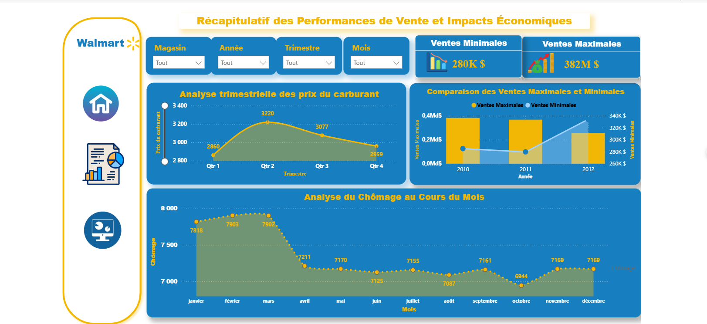

# Analyse des Ventes – Walmart

Ce projet présente une analyse approfondie des ventes de Walmart en tenant compte de l'impact de la température et des prix du carburant. L'objectif est de fournir un tableau de bord interactif permettant d'explorer et de visualiser les données de manière dynamique. Ce projet inclut également le calcul des KPIs (indicateurs de performance clés) pour évaluer l'impact de ces facteurs externes sur les performances des ventes.

## Technologies Utilisées

- **Power BI** : Outil principal utilisé pour la création du tableau de bord interactif et la visualisation des données.
- **DAX** : Langage de calcul utilisé pour créer des mesures avancées et des KPIs.
- **Excel** : Utilisé pour la préparation des données avant leur traitement dans Power BI.
- **Power Query** : Permet la transformation et l'intégration des données dans Power BI.

## Structure du Rapport

### **1. Performance Globale des Ventes**
Cette section présente un aperçu global de l'impact des variations de température et des prix du carburant sur les ventes de Walmart. Elle permet de visualiser les tendances principales et d'identifier les facteurs ayant un effet majeur sur les résultats.

  
*Exemple de graphique illustrant l'impact global des facteurs externes sur les ventes de Walmart.*

### **2. Analyse Approfondie des Ventes**
Dans cette section, nous explorons les ventes de manière plus détaillée en appliquant des filtres dynamiques pour identifier les tendances spécifiques en fonction des températures et des prix du carburant. Les données sont segmentées et présentées sous forme de graphiques interactifs.

  
*Exemple d'analyse approfondie des ventes avec des filtres dynamiques appliqués.*

### **3. Récapitulatif des Ventes**
Un résumé global des ventes, mettant en évidence les tendances clés et les conclusions principales extraites de l'analyse des ventes. Cette section inclut des graphiques comparatifs pour mieux comprendre les performances sur différentes périodes.

  
*Récapitulatif des ventes montrant des comparaisons entre différentes périodes.*

## Conclusion

Ce projet met en lumière l'importance de prendre en compte les facteurs externes, tels que la température et les prix du carburant, pour évaluer la performance des ventes. Grâce à Power BI et DAX, nous avons pu créer un tableau de bord interactif puissant qui permet d'explorer les données en profondeur et d'en extraire des informations pertinentes pour la prise de décisions stratégiques.

---

Pour plus de détails, consultez le rapport complet dans le fichier **walmart sales bi.pbix**.
