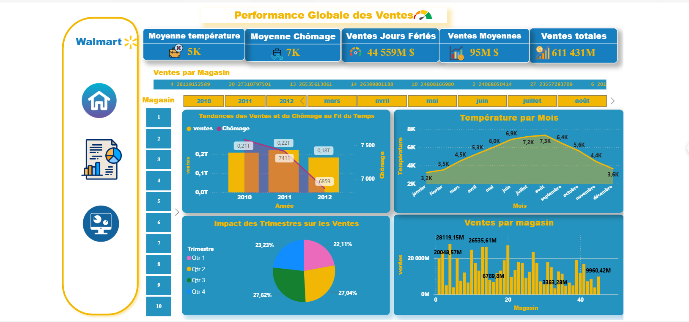

# Sales Analysis – Walmart

This project presents an in-depth analysis of Walmart's sales, considering the impact of temperature and fuel prices. The goal is to provide an interactive dashboard for exploring and visualizing the data dynamically. This project also includes the calculation of KPIs (Key Performance Indicators) to assess the impact of these external factors on sales performance.

## Technologies Used

- **Power BI**: The main tool used for creating the interactive dashboard and visualizing the data.
- **DAX**: The calculation language used to create advanced measures and KPIs.
- **Excel**: Used for data preparation before processing it in Power BI.
- **Power Query**: Used for transforming and integrating the data into Power BI.

## Report Structure

### **1. Overall Sales Performance**
This section presents an overview of how temperature fluctuations and fuel prices impact Walmart sales. It allows for visualizing key trends and identifying the major factors affecting the results.

  
*Example of a chart illustrating the overall impact of external factors on Walmart's sales.*

### **2. In-Depth Sales Analysis**
In this section, we explore the sales in more detail by applying dynamic filters to identify specific trends based on temperature and fuel prices. The data is segmented and presented in interactive graphs.

  
*Example of an in-depth sales analysis with dynamic filters applied.*

### **3. Sales Summary**
A global summary of the sales, highlighting key trends and major conclusions from the sales analysis. This section includes comparative charts for better understanding performance over different periods.

  
*Sales summary showing comparisons between different periods.*

## Conclusion

This project highlights the importance of considering external factors such as temperature and fuel prices when assessing sales performance. Thanks to Power BI and DAX, we were able to create a powerful interactive dashboard that allows for in-depth data exploration and extraction of relevant insights for strategic decision-making.

---

For more details, please consult the full report in the **walmart_sales_bi.pbix** file.

